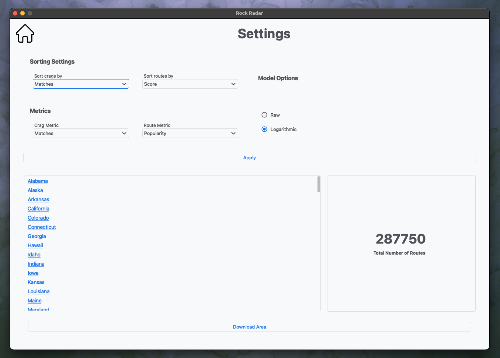
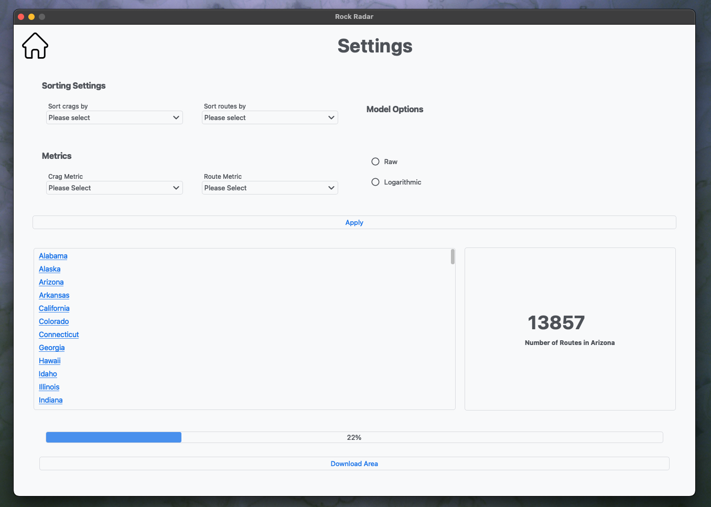
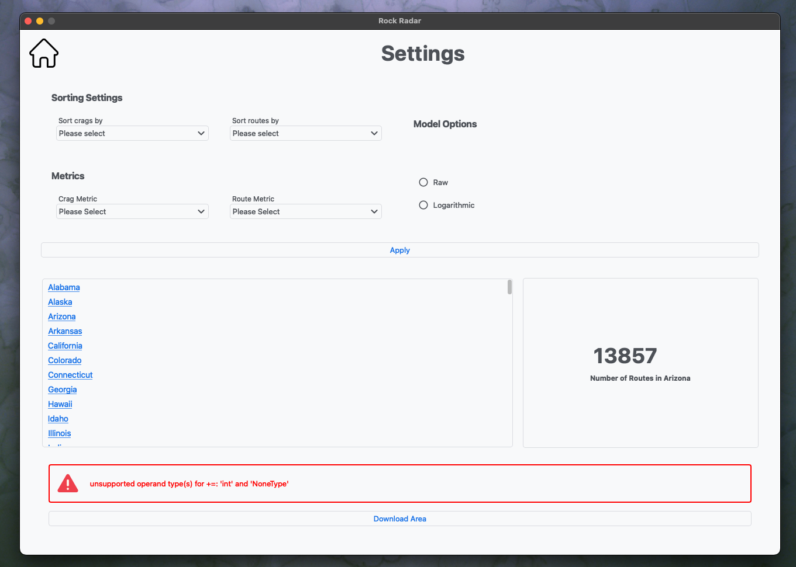
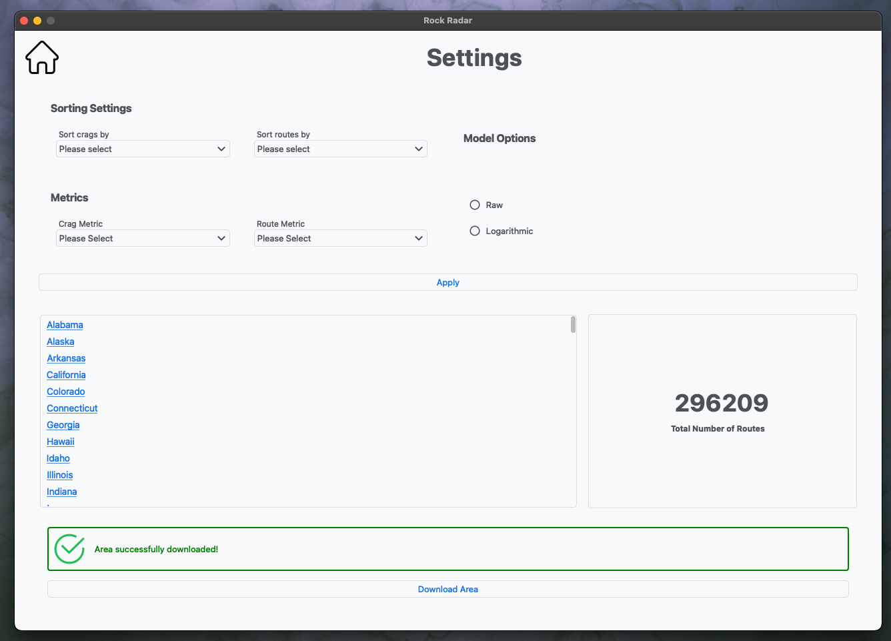
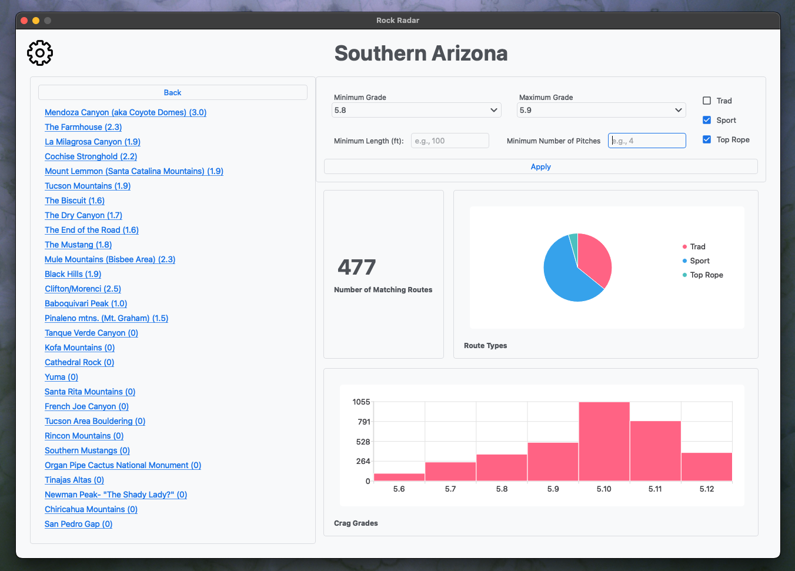

# Rock Radar
Rock Radar is a PyQt application designed to help climbers compare rock
climbing crags, making it easy to find areas with the highest concentration of
quality climbs. Users can apply filters to narrow down routes that meet
specific criteria and download new climbing areas directly from the UI as
needed.
# Tech Stack
- **Language:** Python 3.11
- **Libraries & Frameworks**:
    - PyQt5: For building the GUI
    - Requests: For making HTTP requests to fetch online data
    - BeautifulSoup: For parsing and extracting data from HTML

# Key Features
## Settings

Routes can be sorted alphabetically, by grade, popularity, rating, score,
number of pitches, or length. Crags can be sorted alphabetically, by the number
of matches, total number of routes, popularity, rating, score, average
popularity, average rating, or average score.
<br></br>
Different metrics, such as the number of matches, total routes, average
popularity, average rating, and average score, can be displayed next to a crag.
Users can choose to display length, popularity, rating, or number of pitches
for each crag.
<br></br>

> **Score:** A route's score can be calculated in two ways. The first method
> multiplies the route's popularity by its rating. The second method multiplies
> the route's rating by the logarithm of its popularity, which helps balance
> the influence of highly reviewed routes compared to those with fewer reviews.
> A crag's score is the total of the scores of all its routes.

## Downloading New Areas
New areas can be downloaded directly from the app's UI. The download button
uses a dedicated `QThread` to fetch the selected area, allowing users to
continue interacting with the app seamlessly.
### Progress Bar


### Error Status


### Success Status


## Sorting

Crags in the sidebar are sorted based on the metrics selected on the settings
page. If filters are applied, only routes that match the filters are considered
when comparing areas.

# Installation
## Cloning
```bash
git clone https://github.com/rmejia4209/Rock-Radar.git
```
## Installing Dependencies
```bash
cd Rock-Radar
pipenv install
```
## Setting Up `scraper.py`
The scraper.py script is designed to obscure the data source by dynamically
loading parsing tags from a .env file, reducing the visibility of the target
structure within the codebase. For the project to be fully functional, either
the parsing tags in the .env file must match the structure of the source
website, or data conforming to the format defined in custom_data.py should be
provided.Please note that I do not condone unethical web scraping. Always
review and adhere to a website’s terms of service and respect the ethical
guidelines of data usage.


# Future Improvements
- **Speed Optimizations**
    - The current implementation uses Python 3.11, which does not support
    true parallelization due to the Global Interpreter Lock (GIL). Upgrading to
    Python 3.12 (when versions with better concurrency are available) could
    potentially allow for true parallelization, improving performance.
    - In preliminary tests with 260,000 routes, the load time was around 5
    seconds. Interestingly, Python 3.11's threaded execution reduced the load
    time by 16% with 25,000 routes, likely due to the overhead of setting up
    parallelization and accessing the GIL.
    - The data tree is currently calculated and sorted in the main thread, and
    it could be a candidate for parallelization to further reduce processing
    time and improve efficiency.
- **Persistence of Settings**
    - Implementing a way to persist user settings, such as preferences or
    configurations, would enhance user experience by maintaining their choices
    across sessions.
- **UI Tweaks**
    - While the current UI works, it could benefit from visual improvements.
    UI design is not my strongest point, and I prioritized finalizing the app's
    functionality before focusing on the user interface. Future work will
    involve refining the layout, design, and overall user experience.
- **Add a dedicated Database**
    - Currently, data is stored in a combination of .csv and .json files.
    Introducing a database would improve data management and scalability. A
    lightweight, embedded solution like SQLite would be an appropriate choice
    for this project, offering simplicity and minimal overhead without the need
    for additional server setup
- **Standardize Documentation**
    - Many functions lack docstrings or use inconsistent formats. Adopting a
    uniform style, such as PEP 257, would improve clarity and maintainability.

# Credits
## Icons
- [Back icons created by Freepik - Flaticon](https://www.flaticon.com/free-icons/back)
- [Gear/Setup icons created by Saepul Nahwan - Flaticon](https://www.flaticon.com/free-icons/setup)
- [Home button icons created by Freepik - Flaticon](https://www.flaticon.com/free-icons/home-button)
- [Warning icons created by Good Ware - Flaticon](https://www.flaticon.com/free-icons/warning)
- [Success icons created by Arkinasi - Flaticon](https://www.flaticon.com/free-icons/success)
